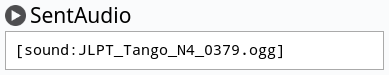
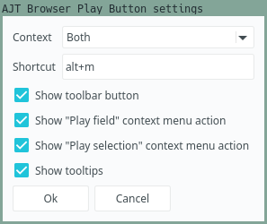

<p align="center"></p>

# AJT Browser Play Button

[](https://ankiweb.net/shared/info/182970692)
[](https://tatsumoto-ren.github.io/blog/join-our-community.html)
[](https://t.me/ajatt_tools)
[](https://www.patreon.com/bePatron?u=43555128)


This tiny add-on adds a play button to the Anki Browser's toolbar.
When clicked, it looks for `[sound:...]`-tags on the selected note
and plays them in the order of their appearance on the note's fields.
If there is selected text, the action is limited to the sound tags
that appear only in the selected text.

If you select "Play field" in the context menu,
the action is limited to the currently selected field.

Each field that contains audio has a play button next to its name.
Pressing on the button plays all audio files in the field.

Audio can be directly played with a shortcut: `alt + m`.

A demo can be viewed on
<a target="_blank" href="https://youtu.be/9rpHtTrk2TM"></a>.

<p align="center"></p>
<p align="center"><i>Screenshot.</i></p>

## Installation

Install from [AnkiWeb](https://ankiweb.net/shared/info/182970692), or manually with `git`:

```
$ git clone 'https://github.com/Ajatt-Tools/BrowserPlayButton.git' ~/.local/share/Anki2/addons21/BrowserPlayButton
```

## Configuration

To configure the add-on, open the Anki Add-on Menu
via `Tools` > `Add-ons` and select `AJT Browser Play Button`.
Then click the `Config` button on the right-side of the screen.

Alternatively, open the Anki Browser and click `Edit` > `AJT Browser Play Button settings...`.

<p align="center"></p>
<p align="center"><i>Settings.</i></p>

If you hover over a setting, it brings up a tooltip explaining what it does.

## Acknowledgements

* [Play audio in browser](https://ankiweb.net/shared/info/388541036). The idea and initial implementation.
* [Ze Frozen Fields](https://ankiweb.net/shared/info/94610912). Field buttons functionality.
[GitHub link](https://github.com/hgiesel/anki_frozen_fields).
